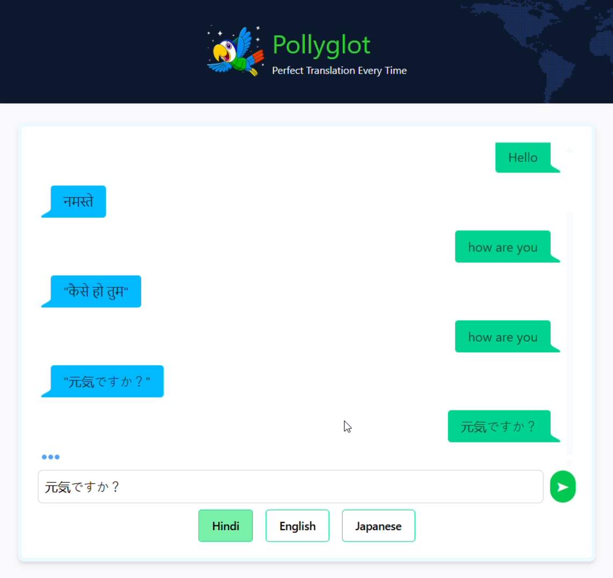

# 🦜 Pollyglot Translator

**Pollyglot** is an AI-powered language translator app built with React. It offers two clean UI styles — one chat-based and one form-based — for translating text between multiple languages. Users can select a target language, type their message, and receive instant translations powered by an AI backend.

---

## 🚀 Features

- 🎯 Translate between Hindi, English, French, Spanish, Japanese, and German
- 💬 Chat-style interface for a conversational experience
- 📝 Form-style translation for a structured view
- ⏳ Loading indicators and UI feedback
- 🔁 One-click start-over functionality
- 🧠 AI-powered translations via DigitalOcean backend

---

## 🧠 How It Works

1. **User inputs** a message and selects a target language.
2. On clicking **Translate**, a POST request is made to:
   ```
   https://goldfish-app-8e5hk.ondigitalocean.app/api/chat
   ```
3. The translated response is returned from the backend.
4. The translation is shown either in a styled chat bubble or a readable box based on UI mode.

---

## 📂 Folder Structure

```
Pollyglot-Translator/
├── public/
├── src/
│   ├── App.jsx
│   ├── Header.jsx
│   ├── LanguageSelector.jsx
│   ├── LanguageSelector2.jsx
│   ├── LoadingState.jsx
│   ├── TranslatedData.jsx
│   ├── assets/
│   │   └── parrot.png
|   ├── index.css
|   ├── main.jsx
└── package.json
```

---

## 💻 Technologies Used

| Tech           | Description                        |
|----------------|------------------------------------|
| React 19       | Frontend framework                 |
| Tailwind CSS   | Utility-first CSS framework        |
| DaisyUI        | UI component plugin for Tailwind   |
| Vite           | Fast bundler and dev server        |
| DigitalOcean   | Hosted AI backend for translation  |

---

## 🖥️ UI Overview

- 🗣️ **Chat Style:** Dynamic conversation bubbles with auto-scroll
- 🧾 **Form Style:** Input > Translate > View response in structured layout
- 🗳️ Language options with both radio and button selectors
- 🔄 Switch UI styles easily with internal state

---

## 🔧 Setup & Run Locally

### 📦 Install Dependencies
```bash
npm install
```

### ▶️ Run in Dev Mode
```bash
npm run dev
```

### 🔍 Preview Production Build
```bash
npm run preview
```

---

## 📸 Screenshots

> You can add screenshots like this:
```md

```

---

## 📤 Deployments

- Vercel
- DigitalOcean App Platform (for backend)

---

## 📌 Scripts in `package.json`

| Script            | Description               |
|-------------------|---------------------------|
| `npm run dev`     | Run local dev server      |
| `npm run build`   | Create production build   |
| `npm run preview` | Preview production build  |

---

## 📈 Future Enhancements

- 🌐 Add auto-detect source language
- 📱 Make fully mobile responsive
- 🗣️ Add voice input/output
- 💾 Save translation history
- 🔐 User authentication and usage limits

---

## 👨‍💻 Author

**Anuj Kumar Maurya**  
Frontend Developer & AI Enthusiast  
🔗 [GitHub](https://github.com/codeXanu)
